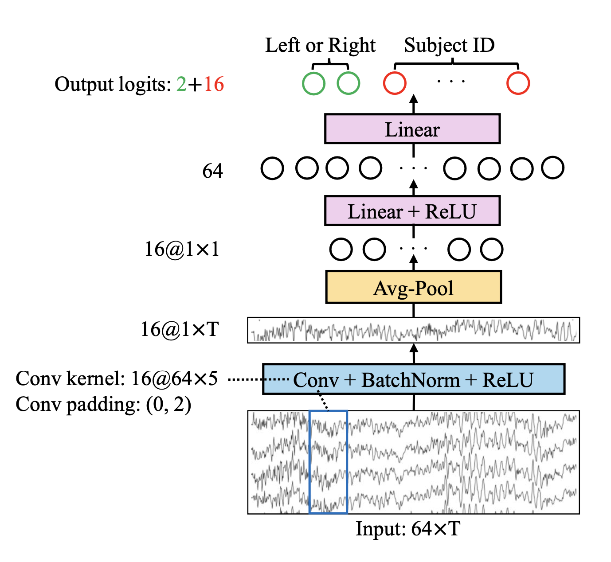
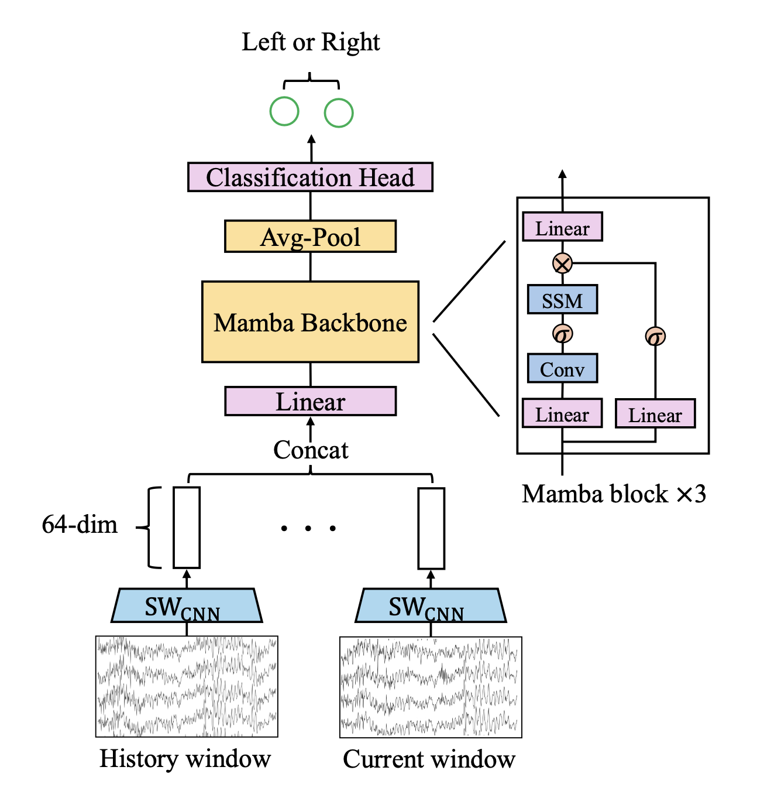

# SWIM-ASAD

The official implementation of paper [SWIM: SHORT-WINDOW CNN INTEGRATED WITH MAMBA FOR EEG-BASED AUDITORY SPATIAL ATTENTION DECODING](https://www.arxiv.org/abs/2409.19884).

The paper has been accepted by SLT 2024.

In complex auditory environments, the human auditory system possesses the remarkable ability to focus on a specific speaker while disregarding others. In this study, a new model named SWIM, a short-window convolution neural network (CNN) integrated with Mamba, is proposed for identifying the locus of auditory attention (left or right) from electroencephalography (EEG) signals without relying on speech envelopes.

SWIM consists of two parts. The first is a short-window CNN (SW$_\text{CNN}$), which acts as a short-term EEG feature extractor and achieves a final accuracy of 84.9\% in the leave-one-speaker-out setup on the widely used KUL dataset. This improvement is due to the use of an improved CNN structure, data augmentation, multitask training, and model combination.

The second part, Mamba, is a sequence model first applied to auditory spatial attention decoding to leverage the long-term dependency from previous SW$_\text{CNN}$ time steps. By joint training SW$_\text{CNN}$ and Mamba, the proposed SWIM structure uses both short-term and long-term information and achieves an accuracy of 86.2\%, which reduces the classification errors by a relative 31.0\% compared to the previous state-of-the-art result.

## Structure



The architecture of SW$_\text{CNN}$. The input is a decision window of an EEG signal with 64 channels and $T$ samples. The output is logits for classifying attention location and subject ID. In this figure, the number in front of the @ represents the model channel dimension, and the + represents the vector concatenation of two dimensions.



The architecture of SWIM. The SW$_\text{CNN}$ is shown in the last figure with the classification head removed, so the output of SW$_\text{CNN}$ is a 64-dim hidden feature. The hidden features from history windows are concatenated with it from the current window as input of Mamba. Then Mamba utilize this input to classify the auditory attention direction of the current window. In this figure, $\times$ means multiplication and $\sigma$ means an activation in the Mamba block.

## Setup

create environment and install dependencies: `bash setup.sh`

## Run scripts

Please run data prepare script first: `bash scripts/data_prepare.sh`

The result of Leave-one-speaker-out setup in Table 2 of the paper: `bash scripts/all_subject_leave_story.sh`

The result of Every-trial setup in Table 2 of the paper: `bash scripts/all_subject_per_trial.sh`

The result of Leave-one-subject-out setup in Table 2 of the paper: `bash scripts/leave_subject.sh`

The result in Fig. 5 of the paper: `bash scripts/channel_exclude.sh`

The result in Fig. 7 of the paper: `bash scripts/all_subject_per_trial_part.sh`

## Citation

```
@article{zhang2024swim,
  title={SWIM: Short-Window CNN Integrated with Mamba for EEG-Based Auditory Spatial Attention Decoding},
  author={Zhang, Ziyang and Thwaites, Andrew and Woolgar, Alexandra and Moore, Brian and Zhang, Chao},
  journal={arXiv preprint arXiv:2409.19884},
  year={2024}
}
```
